<div align="center">


<h1>DevSecOps Pipeline Templates</h1>

<p><strong>The Enterprise Standard for Industrialized Secure Delivery and Policy-Driven Governance</strong></p>

[]()
[]()
[]()
[]()

<br/>

> **"Security is not a checkbox; it's a foundation."** 
> DevSecOps Pipeline Templates is a flagship repository designed to enable organizations to standardize, automate, and govern the entire secure software delivery lifecycle through policy-driven pipeline orchestration.

</div>

---

## 🏛️ Executive Summary

**DevSecOps Pipeline Templates** is a flagship repository designed for Chief Information Security Officers (CISOs), Security Engineers, and DevOps Teams. As the speed of delivery increases, manual security reviews become the primary bottleneck and risk vector.

This platform provides an industrialized approach to **Secure Delivery**, delivering production-ready **Secure CI/CD Templates**, **Policy-as-Code Controls**, **Supply Chain Protection**, and **Compliance Evidence Generators**. It supports **Azure**, **AWS**, **GCP**, and **Kubernetes**, enabling organizations to transition from "Reactive Security" to "Proactive Governance."

---

## 💡 Why DevSecOps Matters

Security must be integrated, not bolted on:
- **Shift-Left**: Identifying vulnerabilities at the point of creation, reducing remediation costs and risks.
- **Supply Chain Security**: Ensuring the integrity of 3rd party dependencies and build artifacts (SBOM).
- **Policy-as-Code**: Enforcing organizational security standards automatically through declarative rules.
- **Continuous Compliance**: Generating audit-ready evidence for every deployment, every time.

---

## 🚀 Business Outcomes

### 🎯 Strategic Security Impact
- **Reduced Risk Profile**: Automatically scanning for secrets, vulnerabilities, and misconfigurations in every PR.
- **Increased Velocity**: Removing manual security gates through automated policy-driven approvals.
- **Standardized Governance**: Ensuring every team, across every cloud, follows the same security "Golden Paths."
- **Audit Readiness**: Automating the collection of compliance evidence, reducing manual effort during audits.

---

## 🏗️ Technical Stack

| Layer | Technology | Rationale |
|---|---|---|
| **Security Engine** | Python, OPA, Conftest | High-performance risk scoring and policy-driven governance orchestration. |
| **Control Plane** | FastAPI | High-performance API for template management and security orchestration. |
| **Frontend** | React 18, Vite | Premium portal for security dashboards, template catalogs, and executive reporting. |
| **IaC Foundation** | Terraform | Multi-cloud infrastructure consistency and secure platform foundation automation. |
| **Database** | PostgreSQL | Centralized repository for security findings, policy state, and history. |
| **Observability** | Prometheus / Grafana | Real-time monitoring of pipeline health, scan durations, and security posture. |

---

## 📐 Architecture Storytelling: 70+ Diagrams

### 1. Executive High-Level Architecture
The holistic vision of the enterprise secure delivery journey.

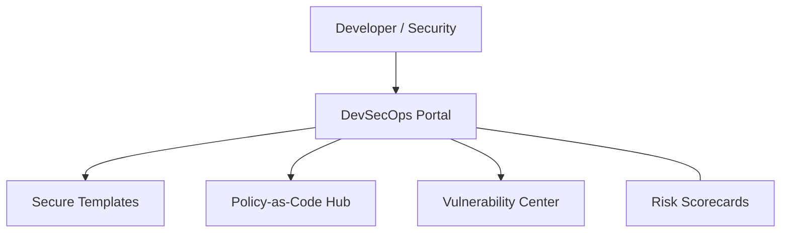

### 2. Detailed Component Topology
The internal service boundaries and management layers of the platform.

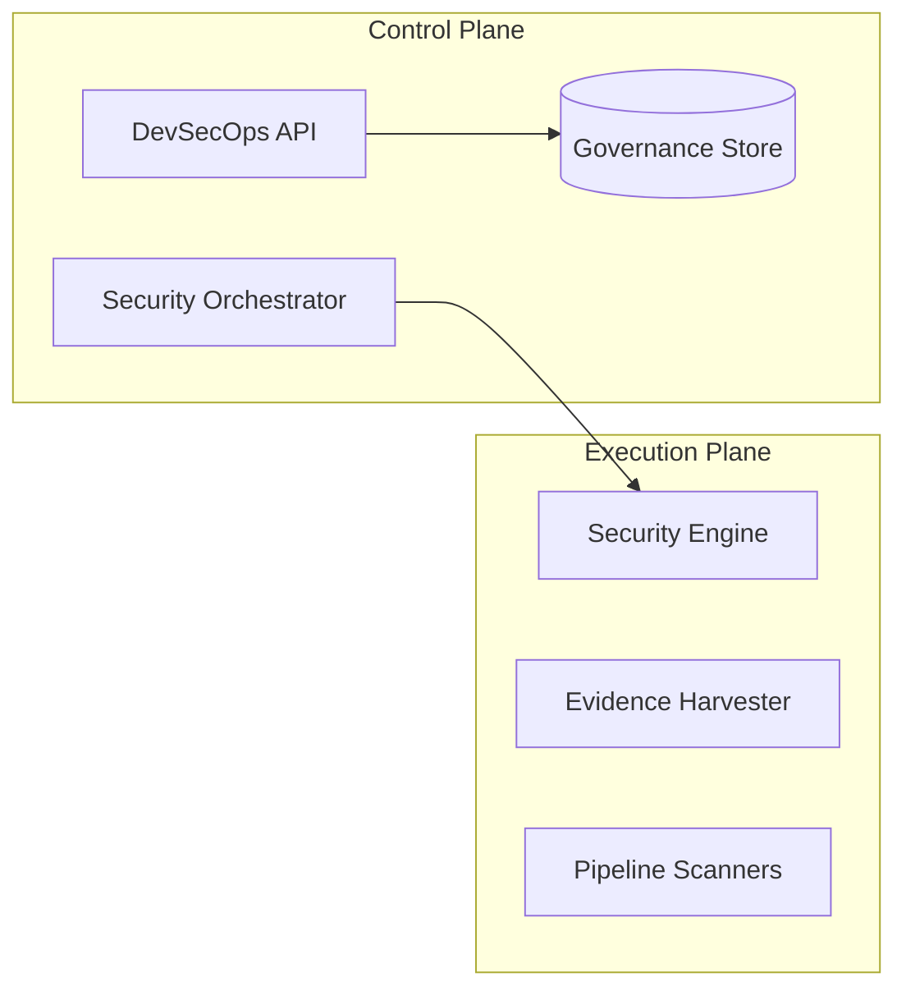

### 3. Developer to Production Request Path
Tracing a code change through the industrialized secure delivery stack.

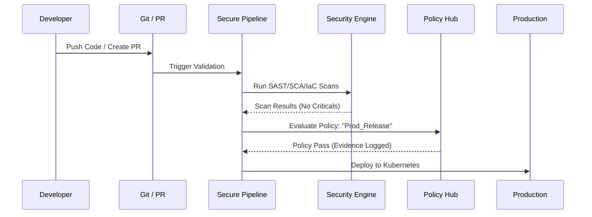

### 4. Security Control Plane
The "Brain" of the framework managing global security standards.

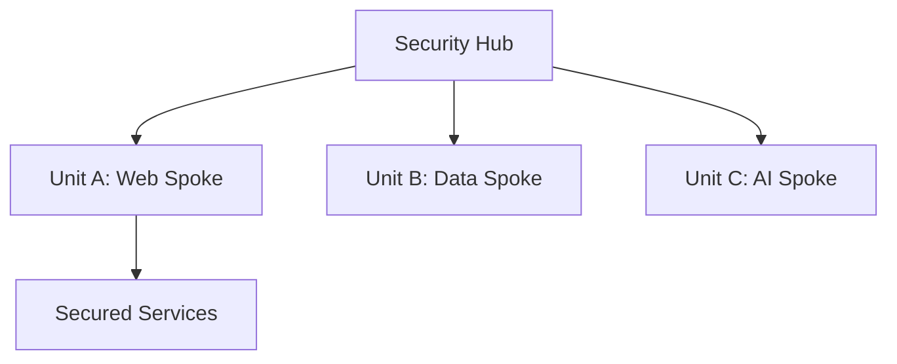

### 5. Multi-Cloud Topology
Synchronizing secure delivery standards across Azure, AWS, and GCP.

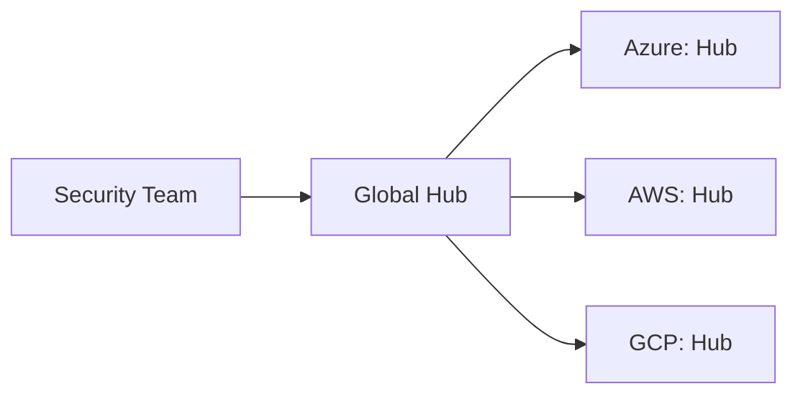

### 6. Regional Deployment Model
Hosting security workers close to the target environments for performance.

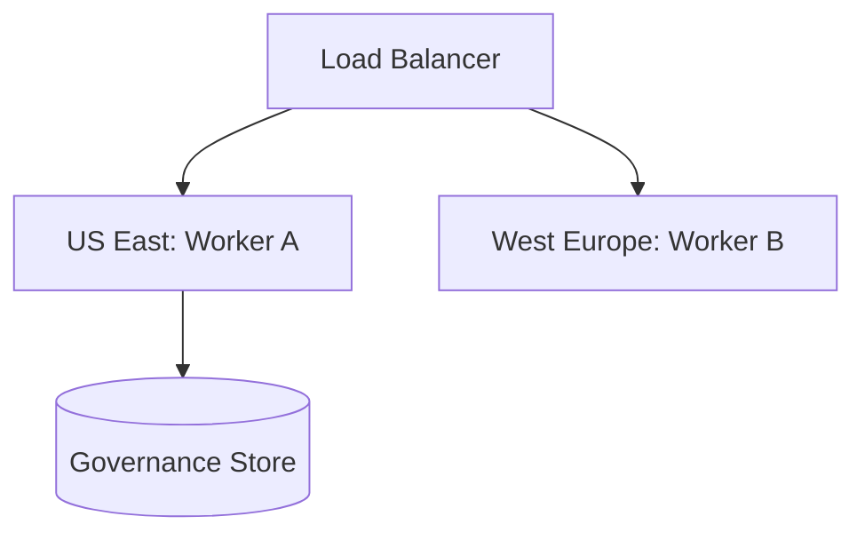

### 7. DR Failover Model
Ensuring security platform continuity during regional cloud outages.

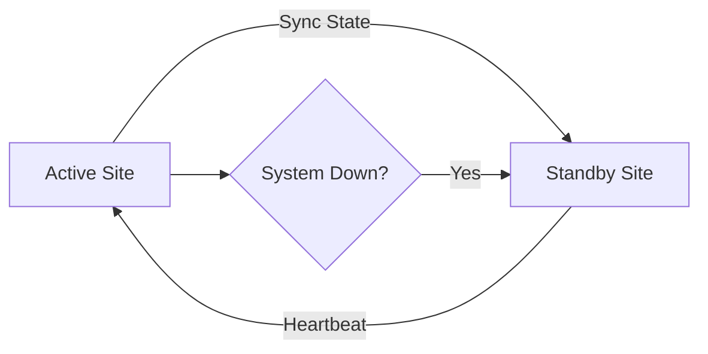

### 8. API Gateway Architecture
Securing and throttling the entry point for security orchestration.

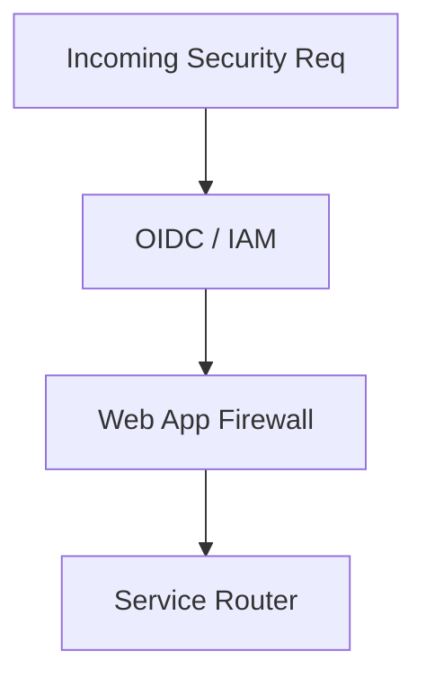

### 9. Queue Worker Architecture
Managing long-running security scans and evidence generation tasks at scale.

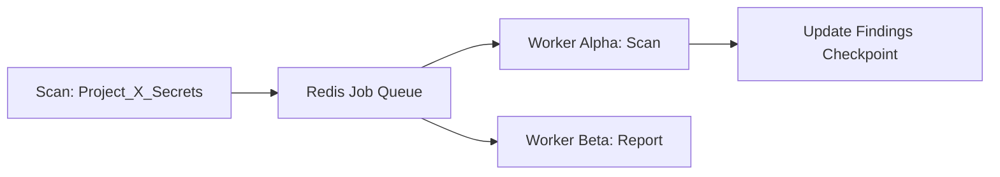

### 10. Dashboard Analytics Flow
How raw security findings become executive risk scorecards.

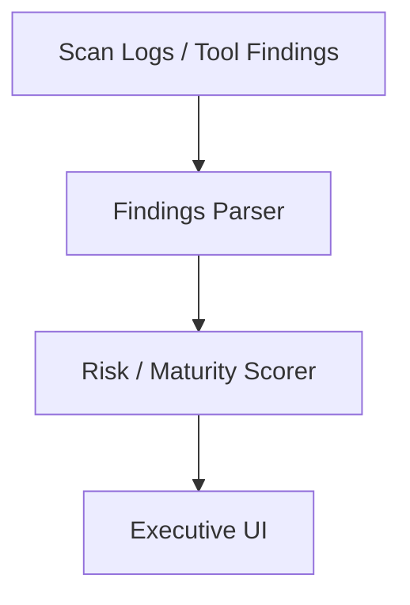

### 11. Commit to Secure Build Workflow
Automating security checks from the very first commit.

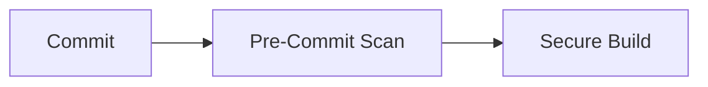

### 12. PR Validation Security Gates
Enforcing security standards before code merges.

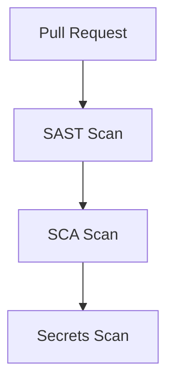

### 13. Branch Protection Model
Ensuring only validated and reviewed code reaches protected branches.

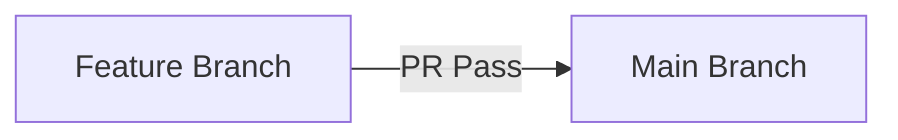

### 14. Artifact Signing Lifecycle
Verifying the integrity and provenance of build artifacts.

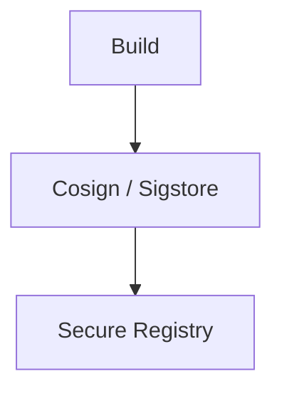

### 15. Versioning + Provenance Flow
Tracking exactly what code, by whom, and when was deployed.

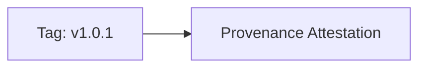

### 16. Release Approval Workflow
Governing production releases with automated and manual gates.

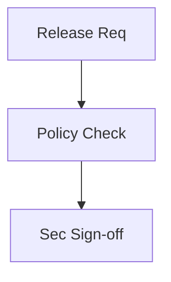

### 17. Blue/Green Secure Deployment
Validating security posture in a staging environment before switching.

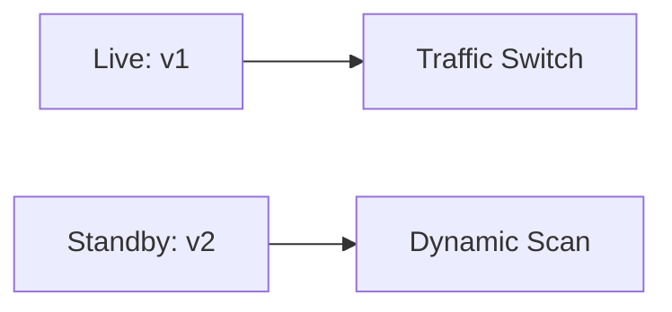

### 18. Canary Release Security Gates
Monitoring security signals during gradual traffic rollouts.

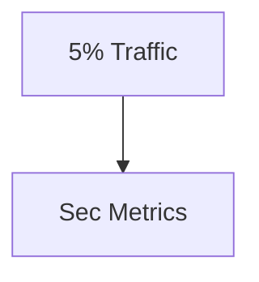

### 19. Rollback Lifecycle
Automated recovery during security incidents or failed deployments.

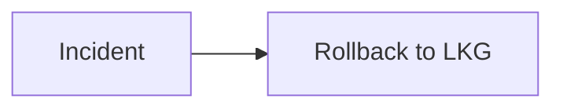

### 20. Change Calendar Governance
Coordinating secure releases to avoid conflict and maintain stability.

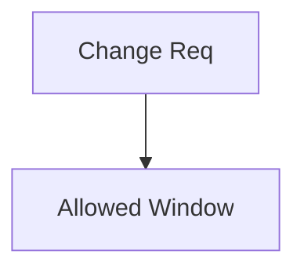

### 21. SAST Pipeline Flow
Static analysis integration for deep code security insights.

```mermaid
graph LR
    Source[Source Code] --> Semgrep[Semgrep Scan]
```

### 22. SCA Dependency Scan Model
Identifying vulnerabilities in 3rd party libraries and dependencies.

```mermaid
graph TD
    Manifest[package.json] --> Snyk[Snyk / Trivy]
```

### 23. Secrets Detection Workflow
Preventing hardcoded credentials from reaching the repository.

```mermaid
graph LR
    Push[Git Push] --> Gitleaks[Gitleaks Scan]
```

### 24. IaC Scanning Lifecycle
Securing infrastructure configurations before provisioning.

```mermaid
graph TD
    TF[Terraform] --> Checkov[Checkov / TFSec]
```

### 25. Container Image Scan Model
Scanning container layers for OS and app vulnerabilities.

```mermaid
graph LR
    Image[Docker Image] --> Grype[Grype / Trivy]
```

### 26. SBOM Generation Flow
Creating a Software Bill of Materials for every release.

```mermaid
graph TD
    Build[Build] --> Syft[Syft: sbom.json]
```

### 27. License compliance workflow
Ensuring all dependencies comply with organizational license policies.

```mermaid
graph LR
    Deps[Deps] --> License[License Audit]
```

### 28. IDE pre-commit security model
Giving developers immediate feedback within their IDE.

```mermaid
graph TD
    IDE[VS Code] --> Lint[Sec Lint]
```

### 29. Vulnerability Triage Lifecycle
The process of assessing and prioritizing discovered findings.

```mermaid
graph LR
    Find[Finding] --> Triage[High/Med/Low]
```

### 30. Risk Acceptance Workflow
Managing exceptions and waivers with documented sign-offs.

```mermaid
graph TD
    Vuln[Critical Vuln] --> Waiver[Risk Accepted]
```

### 31. Signed Artifact Promotion
Only promoting artifacts that have valid cryptographic signatures.

```mermaid
graph LR
    Registry[Staging] -->|Verify| Prod[Production]
```

### 32. Trusted Registry Model
Enforcing use of approved internal container registries.

```mermaid
graph TD
    Req[Pull Image] --> Allow[Registry: internal.io]
```

### 33. Build Runner Isolation Pattern
Protecting the build environment from malicious code execution.

```mermaid
graph LR
    Job[Job] --> Sandbox[Isolated Runner]
```

### 34. Ephemeral Runner Workflow
Using short-lived runners to minimize attack surface.

```mermaid
graph TD
    Start[Provision] --> Build[Build] --> Term[Destroy]
```

### 35. OIDC Workload Identity Flow
Securing pipeline-to-cloud interactions without long-lived secrets.

```mermaid
graph LR
    GH[GitHub Actions] --> STS[Assume Role: OIDC]
```

### 36. Keyless Signing Model
Simplifying artifact signing using ephemeral keys and OIDC.

```mermaid
graph TD
    Artifact[Artifact] --> Sigstore[Sigstore Sign]
```

### 37. Provenance Attestation Workflow
Generating signed statements about how an artifact was built.

```mermaid
graph LR
    Build[Build] --> SLSA[SLSA Attestation]
```

### 38. Dependency Mirror Strategy
Hosting local copies of 3rd party packages to prevent supply chain attacks.

```mermaid
graph TD
    Proxy[Nexus / Artifactory] --> Upstream[NPM Registry]
```

### 40. Zero Trust Delivery Flow
The ultimate secure delivery path where no stage is implicitly trusted.

```mermaid
graph LR
    Step1[Verify] --> Step2[Verify]
```

### 41. Terraform Secure Deploy Model
Applying OPA policies to Terraform plans before execution.

```mermaid
graph LR
    Plan[TF Plan] --> OPA[OPA Audit]
```

### 42. Kubernetes Admission Control
Enforcing security policies at the K8s cluster boundary.

```mermaid
graph TD
    Req[Create Pod] --> Webhook[Kyverno / OPA]
```

### 43. Secrets Injection Workflow
Dynamically injecting secrets into runtimes from secure vaults.

```mermaid
graph LR
    Pod[Pod] --> Vault[Vault Sidecar]
```

### 44. WAF + Ingress Protection Flow
Securing the entry point to production workloads.

```mermaid
graph TD
    Traffic[User] --> WAF[WAF] --> App[App]
```

### 45. Container Runtime Security
Monitoring active containers for anomalous behavior.

```mermaid
graph LR
    Runtime[Runtime] --> Falco[Falco Alerts]
```

### 46. Serverless Secure Deployment
Applying security controls to function-as-a-service delivery.

```mermaid
graph TD
    Code[Code] --> Scan[Sec Scan] --> Lambda[Deploy]
```

### 47. Network Segmentation Model
Isolating platform components through strict network policies.

```mermaid
graph LR
    App[App Tier] ---|No| DB[DB Tier]
```

### 48. Drift Detection Lifecycle
Identifying and remediating manual changes in the cloud.

```mermaid
graph TD
    State[Actual] vs State[Desired]
```

### 49. Backup Evidence Workflow
Ensuring BCDR compliance with verified backup logs.

```mermaid
graph LR
    Job[Backup] --> Evidence[Evidence Store]
```

### 50. Incident Containment Flow
Automated isolation of compromised workloads.

```mermaid
graph TD
    Alert[Intrusion] --> Quarant[Isolate Pod]
```

### 51. OIDC / SSO Auth Flow
Securing the platform with enterprise identity.

```mermaid
graph LR
    User[Security] --> Entra[Azure AD]
```

### 52. RBAC Model
Defining granular permissions for security personas.

```mermaid
graph TD
    Role[Auditor] --> Action[Read Evidence]
```

### 53. Audit Logging Architecture
Centralized and tamper-proof logging for all security events.

```mermaid
graph LR
    Event[Policy Fail] --> Loki[Audit Log]
```

### 54. Metrics Pipeline
Monitoring the performance and reliability of security scanners.

```mermaid
graph TD
    Scanner[Scanner] --> Prom[Prometheus]
```

### 55. Logging Architecture
Global log aggregation for troubleshooting and analysis.

```mermaid
graph LR
    App[App] --> Fluent[Fluent Bit] --> ELK[Elastic]
```

### 56. Tracing Model
Tracing distributed security events and orchestrations.

```mermaid
graph TD
    Step1[Req] --> Step2[Scan]
```

### 57. Security Incident Response
Handling pipeline or platform security breaches.

```mermaid
graph LR
    Detect[Detect] --> IR[Response Team]
```

### 58. Compliance Reporting Cycle
The rhythm of generating and reviewing security posture reports.

```mermaid
graph TD
    Stats[Stats] --> Report[SOC2 / ISO]
```

### 59. Exception Approval Workflow
Managing the lifecycle of security policy exceptions.

```mermaid
graph LR
    Req[Waiver Req] --> Signoff[CISO]
```

### 60. Policy Waiver Lifecycle
Tracking the expiration and renewal of accepted risks.

```mermaid
graph TD
    Active[Active] --> Expired[Expired]
```

### 61. Executive KPI Review Cycle
Reporting secure delivery results to the board.

```mermaid
graph LR
    Metrics[Metrics] --> Deck[Executive Deck]
```

### 62. Vulnerability Backlog Scorecard
Visualizing the burn-down rate of discovered security findings.

```mermaid
graph TD
    Open[500] --> Closed[450]
```

### 63. MTTR Workflow
Mean time to remediate critical security vulnerabilities.

```mermaid
graph LR
    Found[Found] --> Patched[Patched]
```

### 64. Security Maturity Roadmap
The journey from manual security to industrialized DevSecOps.

```mermaid
graph TD
    Level1[Manual] --> Level4[Optimized]
```

### 65. Quarterly Governance Cadence
The rhythm of reviewing platform security and policy effectiveness.

```mermaid
graph LR
    Q1[Scan Audit] --> Q2[Policy Update]
```

### 66. Cost-to-Risk Model
Quantifying the ROI of security automation and risk reduction.

```mermaid
graph TD
    Spend[$] --> Risk_Saved[$$$]
```

### 67. Team Benchmark Comparison
Comparing security posture across different engineering teams.

```mermaid
graph TD
    TeamA[A: 98%] vs TeamB[B: 82%]
```

### 68. Training Enablement Model
Scaling security knowledge across the developer community.

```mermaid
graph LR
    Kit[Security Kit] --> Dev[Developer]
```

### 69. Global Operating Model
Operating the secure delivery platform across regions and time zones.

```mermaid
graph LR
    US[US Hub] --> EU[EU Hub]
```

### 70. Continuous Improvement Loop
The ultimate feedback cycle for security excellence.

```mermaid
graph LR
    Measure[Measure] --> Improve[Improve]
    Improve --> Measure
```

---

## 🛡️ Secure SDLC Methodology

### 1. The Security Pillars
Our platform is built on four core pillars:
- **Shift-Left**: Embedding security tools directly into the developer workflow (IDE, Git, CI).
- **Policy-as-Code**: Enforcing security standards through declarative, version-controlled rules.
- **Supply Chain Trust**: Verifying the integrity of every dependency and every artifact.
- **Evidence-Based Compliance**: Automating the collection of audit-ready data for every deployment.

### 2. Supply Chain Security (SLSA)
We align with the **SLSA (Supply-chain Levels for Software Artifacts)** framework, ensuring build integrity and provenance tracking at every stage of the lifecycle.

---

## 🚦 Getting Started

### 1. Prerequisites
- **Terraform** (v1.5+).
- **Docker Desktop**.
- **Kubernetes Cluster** (local or cloud).
- **OPA / Conftest** installed locally.

### 2. Local Setup
```bash
# Clone the repository
git clone https://github.com/Devopstrio/devsecops-pipeline-templates.git
cd devsecops-pipeline-templates

# Start the Security Control Plane
docker-compose up --build
```
Access the Template Portal at `http://localhost:3000`.

---

## 🛡️ Governance & Security
- **Pipeline Hardening**: All build runners are ephemeral and isolated.
- **Zero-Trust Access**: Platform interactions are secured via OIDC and Entra ID.
- **Automated Evidence**: Every pipeline run generates a signed compliance record for audit readiness.

---
<sub>&copy; 2026 Devopstrio &mdash; Engineering the Future of Industrialized Secure Delivery.</sub>
