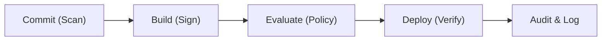
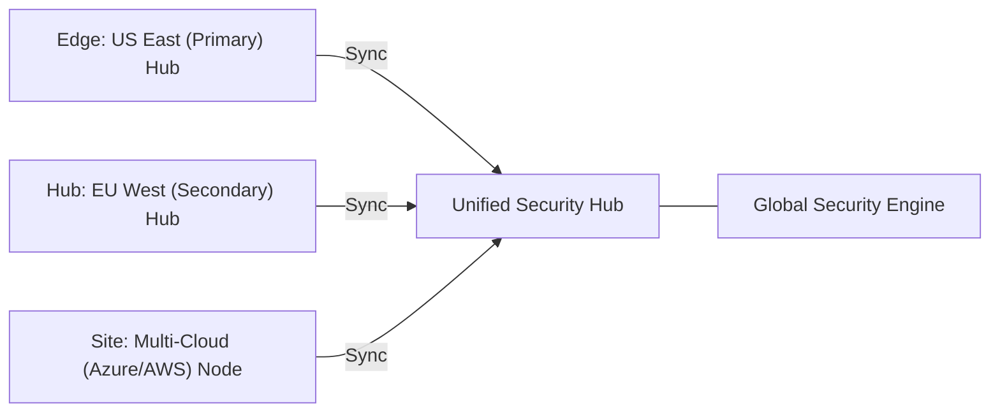
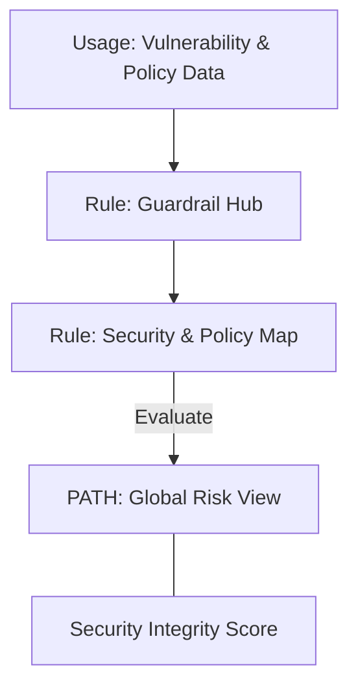
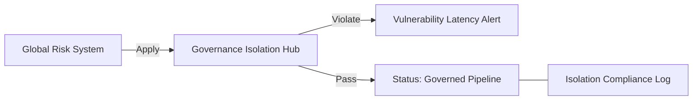
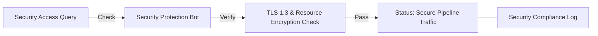
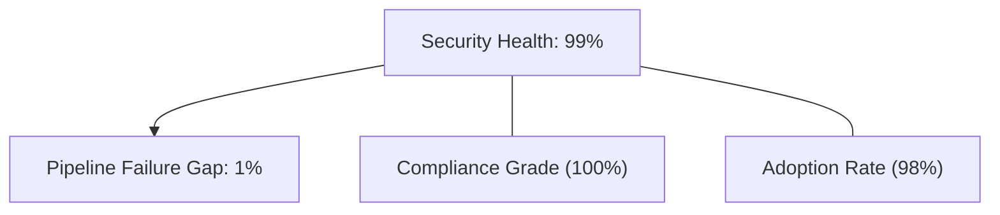
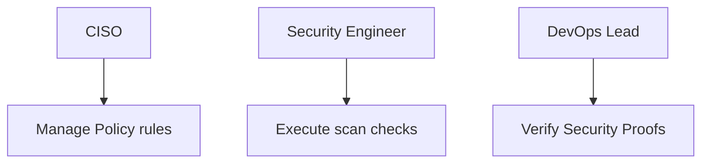
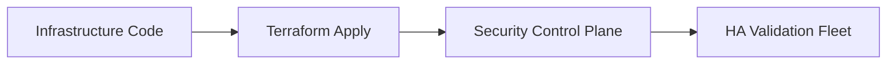
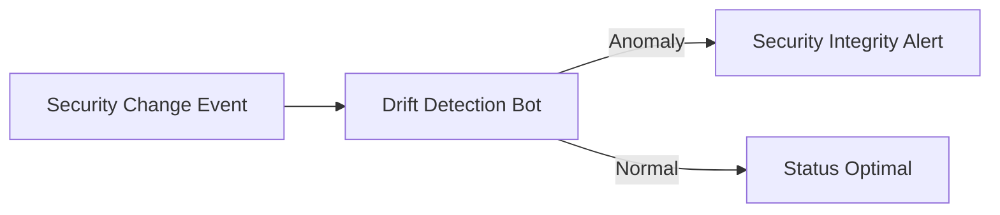
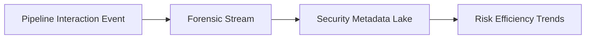

<div align="center">


<h1>DevSecOps Pipeline Templates</h1>

<p><strong>The Institutional-Grade Platform for Standardized Secure Foundations, Pipeline Orchestration Governance, and Multi-Cloud Delivery Ecosystems.</strong></p>

[]()
[]()
[]()

<br/>

> **"Industrializing secure delivery to automate compliance foundations."** 
> **DevSecOps Pipeline Templates** is an enterprise-grade platform designed to provide a secure, measurable, and highly automated foundation for global software delivery operations. It orchestrates the complex lifecycle of secure development—from pipeline design and vulnerability scanning to policy-driven deployment and unified compliance auditing.

</div>

---

## 🏛️ Executive Summary

Fragmented security silos and manual compliance workflows are strategic operational liabilities; lack of centralized pipeline orchestration is a primary barrier to organizational cloud maturity. Organizations fail to maintain a secure delivery foundation not because of a lack of tools, but because of fragmented scanning standards, lack of automated policy validation, and an inability to orchestrate security planes with operational precision.

This platform provides the **Security Intelligence Plane**. It implements a complete **DevSecOps-as-Code Framework**, enabling Security and Platform teams to manage global secure delivery foundations as first-class citizens. By automating the identification of vulnerability bottlenecks through real-time scan analysis and orchestrating the provisioning of secure performance-driven pipeline policies, we ensure that every organizational service—from core microservices to complex AI applications—is governed by default, audited for history, and strictly aligned with institutional security frameworks.

---

## 📐 Architecture Storytelling: Principal Reference Models

### 1. Principal Architecture: Global DevSecOps Pipeline Templates & Security Intelligence Plane
This diagram illustrates the end-to-end flow from pipeline template ingestion and multi-cloud orchestration to security enforcement, compliance validation, and institutional risk auditing.


```mermaid
graph LR
    %% Subgraph Definitions
    subgraph PipelineIngress["Template & Scenario Ingress"]
        direction TB
        Code_Repos["Application / IaC / AI Codebases"]
        Scanner_Libs["SAST / SCA / DAST Tools"]
        Security_Guardrails["OPA Policies / SLSA Standards"]
    end

    subgraph IntelligenceEngine["Security Intelligence Hub"]
        direction TB
        API["FastAPI Security Gateway"]
        PipelineOrchestrator["Global Template & Policy Hub"]
        Governance_Hub["Compliance & Contract Guardrail Hub"]
        AIOps_Validator["Drift & Risk Analysis Hub"]
    end

    subgraph OperationsPlane["Distributed Security Ecosystem"]
        direction TB
        ManagedBuilds["Managed Standardized Secure Builds"]
        ActiveDeployments["Managed Automated Secure Deployments"]
        RegistrySinks["Managed Artifact Delivery Hubs"]
    end

    subgraph OperationsHub["Institutional Risk Hub"]
        direction TB
        Scorecard["Security Maturity Scorecard"]
        Analytics["Vulnerability Flow & Readiness Velocity Stats"]
        Audit["Forensic Security Metadata Lake"]
    end

    subgraph DevOps["DevSecOps-as-Code Framework"]
        direction TB
        TF["Terraform Security Modules"]
        DriftBot["Security & Config Drift Validator"]
        ChatOps["Governance Operations Hub"]
    end

    %% Flow Arrows
    PipelineIngress -->|1. Submit Trigger| API
    API -->|2. Orchestrate Pipeline| PipelineOrchestrator
    PipelineOrchestrator -->|3. Apply Security Guard| Governance_Hub
    Governance_Hub -->|4. Assess Drift| AIOps_Validator
    
    AIOps_Validator -->|5. Execute Build| OperationsPlane
    OperationsPlane -->|6. Notify Status| ChatOps
    API -->|7. Visualize Health| Scorecard
    
    Scorecard -->|8. Track Maturity| Analytics
    Scorecard -->|9. Record Validation| Audit
    
    TF -->|10. Provision Backbone| IntelligenceEngine
    DriftBot -->|11. Inject Security Risk| PipelineOrchestrator
    Audit -->|12. Improve Operations| ManagedBuilds

    %% Styling
    classDef ingress fill:#f5f5f5,stroke:#616161,stroke-width:2px;
    classDef intel fill:#e8eaf6,stroke:#1a237e,stroke-width:2px;
    classDef operations fill:#e1f5fe,stroke:#01579b,stroke-width:2px;
    classDef ops fill:#ede7f6,stroke:#311b92,stroke-width:2px;
    classDef devops fill:#e8f5e9,stroke:#1b5e20,stroke-width:2px;

    class PipelineIngress ingress;
    class IntelligenceEngine intel;
    class OperationsPlane operations;
    class OperationsHub ops;
    class DevOps devops;
```

### 2. The Secure Delivery Lifecycle Flow
The continuous path of a DevSecOps platform from initial commit (scan) and build (sign) to active evaluate (policy), deploy (verify), and institutional forensic auditing.


```mermaid
graph LR
    Commit["Commit (Scan)"] --> Build["Build (Sign)"]
    Build --> Evaluate["Evaluate (Policy)"]
    Evaluate --> Deploy["Deploy (Verify)"]
    Deploy --> Audit["Audit & Log"]
```

### 3. Distributed Security Topology
Strategically orchestrating standardized security templates across global development teams, diverse repositories, and multi-cloud targets, providing a unified institutional view of global security health and operational readiness.


```mermaid
graph LR
    RegionA["Edge: US East (Primary) Hub"] -->|Sync| Hub["Unified Security Hub"]
    BU["Hub: EU West (Secondary) Hub"] -->|Sync| Hub
    Cloud["Site: Multi-Cloud (Azure/AWS) Node"] -->|Sync| Hub
    Hub --- Logic["Global Security Engine"]
```

### 4. Supply Chain Governance & High-Trust Data Plane Protection Flow
Executing complex logic for securing the bridge between external dependencies and internal build runners, ensuring every organizational identity is verified and every artifact access is according to institutional standards.


```mermaid
graph TD
    SecurityData["Usage: Vulnerability & Policy Data"] --> Bridge["Rule: Guardrail Hub"]
    Bridge --> PolicyMap["Rule: Security & Policy Map"]
    PolicyMap -->|Evaluate| Context["PATH: Global Risk View"]
    Context --- Estimate["Security Integrity Score"]
```

### 5. Multi-Cloud Security Federation & Governance Flow
Automatically managing unified secure delivery standards across global regions and diverse CI/CD platforms, ensuring institutional data residency and security boundaries by default.


```mermaid
graph LR
    Org["Global Risk System"] -->|Apply| Guard["Governance Isolation Hub"]
    Guard -->|Violate| Alert["Vulnerability Latency Alert"]
    Guard -->|Pass| Verify["Status: Governed Pipeline"]
    Verify --- Audit["Isolation Compliance Log"]
```

### 6. Encryption & Perimeter Protection Flow (Security Standard)
Managing the lifecycle of a pipeline request, automatically enforcing institutional TLS 1.3 and resource encryption standards as required by security policy, ensuring zero-latency security confidence.


```mermaid
graph LR
    PipelineReq["Security Access Query"] -->|Check| Gatekeeper["Security Protection Bot"]
    Gatekeeper -->|Verify| TLS["TLS 1.3 & Resource Encryption Check"]
    TLS -->|Pass| Admit["Status: Secure Pipeline Traffic"]
    Admit --- Audit["Security Compliance Log"]
```

### 7. Institutional DevSecOps Maturity Scorecard
Grading organizational performance based on key indicators: SAST/SCA Compliance Grade, Policy-as-Code Adoption Index, and Vulnerability Burn-down Rates.


```mermaid
graph TD
    Post["Security Health: 99%"] --> Risk["Pipeline Failure Gap: 1%"]
    Post --- C1["Compliance Grade (100%)"]
    Post --- C2["Adoption Rate (98%)"]
```

### 8. Identity & RBAC for Security Governance
Managing fine-grained access to security hubs, provisioning workers, and audit logs between CISOs, Security Engineers, and DevOps Leads.


```mermaid
graph TD
    CISO["CISO"] --> Hub["Manage Policy rules"]
    Security["Security Engineer"] --> Exec["Execute scan checks"]
    DevOps["DevOps Lead"] --> Audit["Verify Security Proofs"]
```

### 9. IaC Deployment: DevSecOps-as-Code Framework
Using modular Terraform to deploy and manage the versioned distribution of the security tracking hubs, policy protection workers, and forensic metadata lakes.


```mermaid
graph LR
    HCL["Infrastructure Code"] --> TF["Terraform Apply"]
    TF --> Engine["Security Control Plane"]
    Engine --> Clusters["HA Validation Fleet"]
```

### 10. AIOps Security Drift & Risk Validation Flow
Using advanced analytics to identify sudden surges in critical vulnerabilities, unauthorized pipeline bypasses, suspicious configuration drifts, or unusual deployment pattern changes that could result in institutional risk.


```mermaid
graph LR
    Drift["Security Change Event"] --> Analyzer["Drift Detection Bot"]
    Analyzer -->|Anomaly| Alert["Security Integrity Alert"]
    Analyzer -->|Normal| Pass["Status Optimal"]
```

### 11. Metadata Lake for Forensic Security Audit
Storing long-term records of every build executed (metadata), every security scan recorded, and every provenance attestation history for institutional record-keeping, compliance auditing, and post-provisioning forensics.


```mermaid
graph LR
    Provision["Pipeline Interaction Event"] --> Stream["Forensic Stream"]
    Stream --> Lake["Security Metadata Lake"]
    Lake --> Trends["Risk Efficiency Trends"]
```

---

## 🏛️ Core Governance Pillars

1.  **Unified Foundation Coordination**: Maximizing resilience by centralizing all security measurement through a single institutional plane.
2.  **Automated Pipeline Provisioning**: Eliminating "manual gating" scenarios through proactive orchestration and pattern verification.
3.  **Sequential Policy Intelligence**: Ensuring zero-interruption operations through dependency-aware policy-driven delivery engineering.
4.  **Zero-Trust Guardrail Protection**: Automatically enforcing identity-based access and rule evaluation across all pipeline tiers.
5.  **Autonomous Operations Logic**: Guaranteeing reliability through automated industry-specific security monitoring runbooks.
6.  **Full Pipeline Auditability**: Immutable recording of every template change and compliance provision for institutional forensics.

---

## 🛠️ Technical Stack & Implementation

### Security Engine & APIs
*   **Framework**: Python 3.11+ / FastAPI.
*   **Performance Engine**: Custom Python-based logic for multi-region pipeline provisioning and DORA-style readiness metrics.
*   **Integrations**: Native connectors for SonarQube, Snyk, Checkov, and OPA/Gatekeeper.
*   **Persistence**: PostgreSQL (Security Ledger) and Redis (Live Policy State).
*   **Auth Orchestrator**: Federated OIDC/SAML for least-privilege security management access.

### Governance Dashboard (UI)
*   **Framework**: React 18 / Vite.
*   **Theme**: Dark, Slate, Indigo (Modern high-fidelity security aesthetic).
*   **Visualization**: D3.js for delivery topologies and Recharts for readiness velocity analytics.

### Infrastructure & DevOps
*   **Runtime**: AWS EKS or Azure Kubernetes Service (AKS) for management plane.
*   **Security Hub**: Managed event sourcing for immutable security timeline reconstruction.
*   **IaC**: Modular Terraform for deploying the security engine and validation fleet.

---

## 🏗️ IaC Mapping (Module Structure)

| Module | Purpose | Real Services |
| :--- | :--- | :--- |
| **`infrastructure/security_hub`** | Central management plane | EKS, PostgreSQL, Redis |
| **`infrastructure/enforcers`** | Distributed template provisioners | Azure, AWS, GCP APIs |
| **`infrastructure/pipeline_pipes`** | Template Execution Hubs | Webhooks, Lambda |
| **`infrastructure/auditing`** | Forensic security sinks | S3, Athena, Quicksight |

---

## 🚀 Deployment Guide

### Local Principal Environment
```bash
# Clone the DevSecOps repository
git clone https://github.com/devopstrio/devsecops-pipeline-templates.git
cd devsecops-pipeline-templates

# Configure environment
cp .env.example .env

# Launch the Security stack
make init

# Trigger a mock template update and automated guardrail validation simulation
make simulate-devsecops
```

Access the Management Portal at `http://localhost:3000`.

---

## 📜 License
Distributed under the MIT License. See `LICENSE` for more information.

---
<div align="center">
  <p>© 2026 Devopstrio. All rights reserved.</p>
</div>
